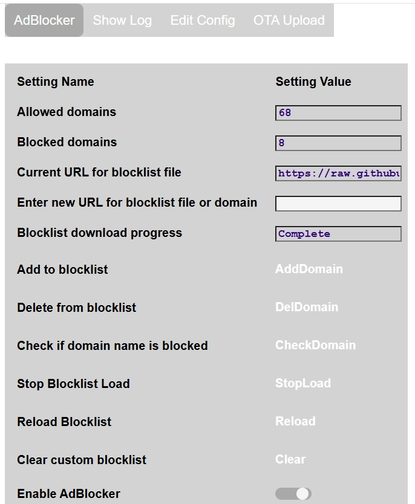

# ESP32_AdBlocker  
(This Repo Based on s60sc/ESP32_AdBlocker v3.3.1)  
(이 Repo는 s60sc/ESP32_AdBlocker v3.3.1에 기반을 두고 있습니다)  
  
ESP32_AdBlocker acts as a DNS Sinkhole (like [Pi-Hole](https://pi-hole.net)) by returning 0.0.0.0 for any domain names in its blocklist, else uses an external DNS server to resolve IP addresses. This prevents content being retrieved from or sent to blocked domains. A web server is provided to control the service and monitor its operation. 
  
## Requirements  
ESP32_AdBlocker is an Arduino sketch. The ESP32 module needs PSRAM: 
* ESP32-S3 with 8MB PSRAM can host a currently sized blocklist. Blocklist checks take <50 micro seconds.  
(ESP32-S3 with 4MB PSRAM Not Supported on My Fork) (Using Original)  
PSRAM 4M의 ESP32은 이 Fork에서 지원되지 않으므로 오리지널을 써주세요  
  
Please buy ESP32-S3 `N8R8` or `N16R8`  
ESP32-S3 `N8R8`나 `N16R8`를 구매해주세요  
  
## Operation  
  
  
After power up, the defaut blocklist will be downloaded. It will take several minutes for ESP32_AdBlocker to be ready after processing and sorting the data. Progress can be monitored on the web page. Subsequent reloads of the same file are much quicker as only updates need to be processed. ESP32-S3 is about twice as fast as the ESP32.  
As only one file can be downloaded, a consolidated blocklist should be used. Ideally select a file less than the size of the PSRAM. The file format should be in either HOSTS format or Adblock format (only domain name entries processed). The following site for example provides a list of suitable files: ~~https://github.com/StevenBlack/hosts~~ https://dns.dateno1.com/hosts.  
  
ESP32_AdBlocker will subsequently download the selected file daily at a given time to keep the blocklist updated. The user can also individually add their own sites to block or unblock which are stored in a local custom blocklist.  
  
The entries on the ESP32_AdBlocker web page are:  
* **Allowed domains**: number of domain requests which have been allowed through since restart  
* **Blocked domains**: number of domain requests which have been blocked since restart  
* **Current URL for blocklist file**: URL for blocklist being used  
* **Enter new URL for blocklist or domain**:  
  * After entering new URL for blocklist, press **Reload** button to download, or leave blank to reload current blocklist.  
  * After entering extra domain URL to be blocked, press **AddDomain** button. Not added if a duplicate or not resolvable. Alert message will show result.  
  * After entering existing domain URL to be be removed from blocklist, press **DelDomain** button. Alert message will show result.  
  * After entering domain URL to check if in blocklist, press **CheckDomain** button. Alert message will show result.  
* **Stop Blocklist Load**: Press **StopLoad** button to stop the currently downloading blocklist.  
* **Clear custom blocklist**: Clear the custom entries manually added or removed by user  
* **Enable AdBlocker**: Toggle Ad blocking on or off  
  
  
To make ESP32_AdBlocker your preferred DNS server, enter its IPv4 address in place of the current DNS server IPs in your router / devices. ESP32_AdBlocker does not have an IPv6 address but some devices use IPv6 by default, so disable IPv6 DNS on your device / router to force it to use IPv4 DNS.  
Eg for a Windows PC network adapter, to use AdBlocker as DNS Server having IP address `192.168.1.168`, at the Windows command prompt, enter:  
`netsh interface ip set dns "Wi-Fi" static 192.168.1.168`  
To switch back to usual DNS Server, eg Google, enter:  
`netsh interface ip set dns "Wi-Fi" static 8.8.8.8`  
  
Browsers must have **Use secure DNS** disabled as this overrides adapter and router DNS settings.  
  
--------------------------------------------------------------------------------------------------------------------------------------------

## Installation  
설치  
  
At First You Need to Download&Install `Arduino IDE`  
가장 먼저 `Arduino IDE`를 설치해주세요  
  
Download Lastest from Release and Extract that, Change application folder name to 'ESP32_AdBlocker'  
GitHub Release의 최신 버전을 받아서 압축 해제후 폴더 이름을 'ESP32_AdBlocker'로 변경해주세요  

If You Don't Want to Auto Update Files from GitHub Edit 'checkDataFils()' in 'setupAssist.cpp' or 'GITHUB_PATH' in 'appGlobals.h'  
만일 GitHub에서 에서 자동으로 업데이트 되는걸 원치 않으시면 'setupAssist.cpp'의 'checkDataFils()'나 'appGlobals.h'의 'GITHUB_PATH'를 수정해주세요  
  
If You Want to Diable `DNS Result` Log Comment 2 Lines in 'externalDNS.cpp'  
`DNS Result` 로그를 끄길 원하시면 'externalDNS.cpp'의 2줄을 주석처리 해주세요  
  
Compile using esp32 arduino core min v3.1.1 with PSRAM enabled and the following Partition scheme:  
ESP32 Arduino Core v3.1.1이상 버전을 설치후 PSRAM 활성화하고, 다음 파티션 구조로 설정해주세요  
* ~v1.2 - `8M with spiffs (...)`  
* v1.2 이하 `8M with spiffs (...)`  
* v1.3~ - `Custom` (If you Using 8M PSRAM Device Using 'Partition_8M.csv' After Rename)  
* v1.3이상 `Custom` (만일 8M PSRAM 기종을 쓰신다면 'Partition_8M.csv'를 이름 변경해서 써주세요)  
  
  
~v1.2  
  
v1.3~  
Using This Build Option  
이 빌드 옵션을 써주세요  
  
You Need to Waiting Boot at First Time (UnLike Original Version It ReTry to Connnect SSID and It will Delay AP Mode)  
초회에는 부팅 완료를 기다릴 필요가 있습니다 (오리지널 버전과는 달리 SSID 연결 재시도를 하므로 AP Mode가 지연됩니다)  
  
On first installation, the application will start in wifi AP mode - connect to SSID: **ESP32_AdBlocker_...**, to allow router and password details to be entered via the web page on `192.168.4.1`. The configuration data file (except passwords) is automatically created, and the application web pages automatically downloaded from GitHub to the **/data** folder in LittleFS when an internet connection is available.  
최초 설치시 Wifi AP Mode로 실행되니 **ESP32_AdBlocker_...** 패턴의 SSID에 접속하여 192.168.4.1을 브라우저로 접속후 무선 정보를 입력해주세요. 설정 파일 (비번 제외)이 자동으로 생성된후 자동으로 GitHub에서 LittleFS의 **/data** 폴더에 자동으로 웹페이지가 받아집니다  
  
If You Using It without Internet or Environment that Can't Connect GitHub Upload Files by OTA Menu or WebDAV  
만일 인터넷이 안 되거나 GitHub에 접속이 불가능한 환경에서 사용하신다면 OTA Menu나 WebDAV로 파일들을 올려주세요  
  
To the **/data** folder files, can be made using the **OTA Upload** tab. The **/data** folder can also be reloaded from GitHub using the **Reload /data** button on the **Edit Config** tab, or by using a WebDAV client.  
**/data** 폴더를 변경하실려면 **OTA Upload** 텝이나 WebDAV 클라를 사용해주세요. 해당 폴더는 **Edit Config** 텝의 **Reload /data** 버튼을 누르는것으로 재설정이 가능합니다  
  
If You Want Debug Using USB Cable, Please Enable 'USB CDC on Boot' option  
USB Cable로 디버그를 하길 원하신다면 'USB CDC on Boot'옵션을 활성화해주세요  
  
Test WebDAV failed with Windows Internal Client (You maybe install client for WebDAV)  
Windows 내장 WebDAV 클라로 시험했을떄 작동 실패하였습니다 (WebDAV 클라를 별도로 설치해야 합니다)  
  
You Must ReConnect USB Cable after Flashing (Reset by RTS Pin Not Worked at First Time)  
플레싱후 케이블을 탈착해야 합니다 (RTS Pin을 사용한 재부팅이 초회에는 작동하지 않습니다)  
  
--------------------------------------------------------------------------------------------------------------------------------------------

## Configuration  
  
More configuration details accessed via **Edit Config** tab, which displays further buttons:  
  
* **Network**:  
  
Additional network and webserver settings. In particular set:  
  * Router IP Address to obtain static IP  
  * Static IP Address, used as AdBlocker DNS Server IP  
  * You Must Set Login ID (Optional user name for web page login) and PW (Optional web page password) (`Security is Not Optional!`)  
  * 반드시 로그인 ID (Optional user name for web page login)및 비번 (Optional web page password)을 설정해주세요 (`보안은 옵션이 아닙니다!`)  
  
* **Settings**:  
Environmental settings affecting blocklist operation.  
  
* **Ethernet**:   
Select the required [Network](#network-selection). To configure Ethernet, define the SPI pin numbers used to connect to the external Ethernet controller.  
Press **Save** to make changes persistent.  
  
## Logging  
  
The application log messages can be monitored on the web page tab **Show Log**.  
  
The **Verbose** button will reveal extra logging for each blocked or accepted connection.  
  
If You Want Debug Using USB Cable, Use 'pio device monitor --baud 115200'  
USB Cable로 디버그를 하길 원하신다면 'pio device monitor --baud 115200'를 사용해주세요  
  
You Need to Install Python for pio Command  
pio 명령을 쓰기 위해서는 Python을 설치할 필요성이 있습니다  
  
## Network Selection  
  
Default network interface is Wifi, but Ethernet could be used instead using boards with built in Ethernet, or by connecting an external Ethernet controller.  
Feature only tested for W5500 Ethernet controller connected to ESP32S3 board.  
The selected network interface is available after configuration and reboot.  
  
Options:  
* **WiFi**: default, also fallback if Ethernet cannot be connected  
* **Eth+AP**: Ethernet plus ESP Access Point. Do not open web pages on each network concurrently.  
* **Ethernet**: Ethernet only, no Wifi  
  
  
